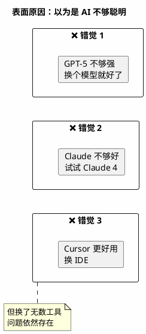
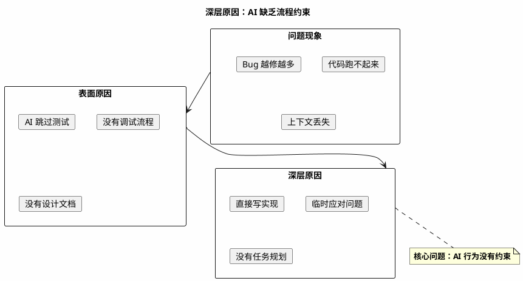
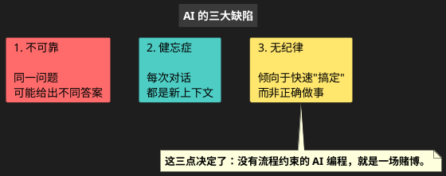
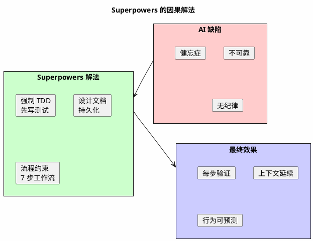
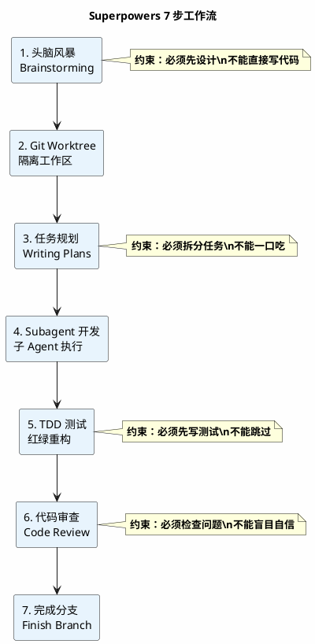
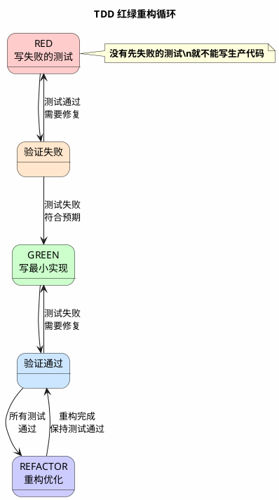
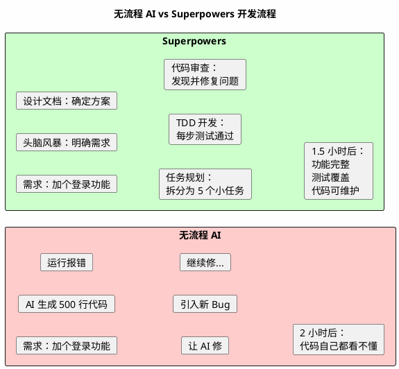

# Superpowers 入门指南：从问题到解决

> 用因果体结构理解为什么需要 Superpowers，以及它如何解决问题

---

## 因果链概览

```
问题（果） → 表面原因 → 深层原因 → 根本原因 → 解决方案 → 最终结果
```

---

## 第一层：问题现象

### 你是否遇到过这些情况？

| 问题 | 场景描述 | 发生频率 |
|------|----------|----------|
| 代码跑不起来 | AI 生成了一堆代码，运行时报错 | 每次 |
| Bug 越修越多 | 让 AI 修一个 Bug，结果引入三个新 Bug | 经常 |
| 上下文丢失 | 每次对话都要重新解释项目背景 | 每次 |
| 代码看不懂 | AI 写的代码自己都看不懂，更不敢交给团队 | 经常 |
| 重复造轮子 | 同样的功能，AI 换了个方式重复实现 | 经常 |

**如果你遇到过以上任意 2 个问题，请继续阅读。**

---

## 第二层：表面原因

### 人们通常以为是 AI 不够聪明



---

## 第三层：深层原因

### 真正的问题：AI 缺乏稳定的流程



---

## 第四层：根本原因

### AI 的三大缺陷



---

## 第五层：解决方案

### Superpowers 的因果解法



---

## 第六层：7 步工作流

### 每一步都有约束



---

## 第七层：TDD 红绿重构

### 测试先行的核心循环



---

## 第八层：实际效果

### 效果对比

| 指标 | 无流程 AI | Superpowers |
|------|-----------|-------------|
| 代码质量 | 靠运气 | 流程保证 |
| Bug 率 | 高（3-5 个/功能） | 低（0-1 个/功能） |
| 上下文管理 | 每次丢失 | 持久化保存 |
| 团队协作 | 难以交接 | 文档可传承 |
| 调试效率 | 1 小时+/Bug | 10 分钟/Bug |

### 开发时间对比



---

## 第九层：行动召唤

### 立即开始

**Step 1：安装（3 分钟）**

```
/plugin marketplace add obra/superpowers-marketplace
/plugin install superpowers@superpowers-marketplace
```

**Step 2：验证（1 分钟）**

开启新会话，输入：
```
帮我规划这个功能：待办事项列表
```

**Step 3：观察**

观察 AI 是否自动调用 `brainstorming` 和 `writing-plans` 技能。

---

### 你会得到

```
✅ 一个经过设计的功能方案
✅ 一个可执行的实施计划
✅ 每步都有测试保护的代码
✅ 可审查、可维护的最终结果
```

---

## 常见误区

| 误区 | 真相 |
|------|------|
| Superpowers 会让 AI 变慢 | 前期多花时间，但调试时间大幅减少 |
| 只有大项目才需要 | 小项目更需要流程约束 |
| 学会了就不需要 | Superpowers 让 AI 遵循流程，流程本身就是价值 |

---

## 下一步

**免费系列教程**：

1. [第 1 篇：安装与验证](01-installation.md)
2. [第 2 篇：核心工作流详解](02-core-workflow.md)
3. [第 3 篇：实战案例](03-real-world-example.md)
4. [第 4 篇：进阶技能与团队协作](04-advanced-teams.md)

---

*「让 AI 编程从碰运气，变成稳定输出」——这是 Superpowers 的承诺。*
