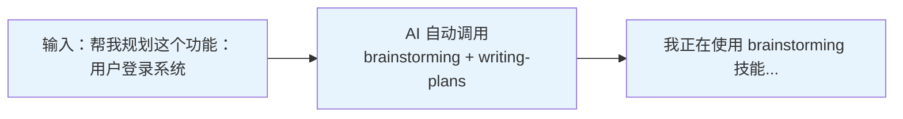
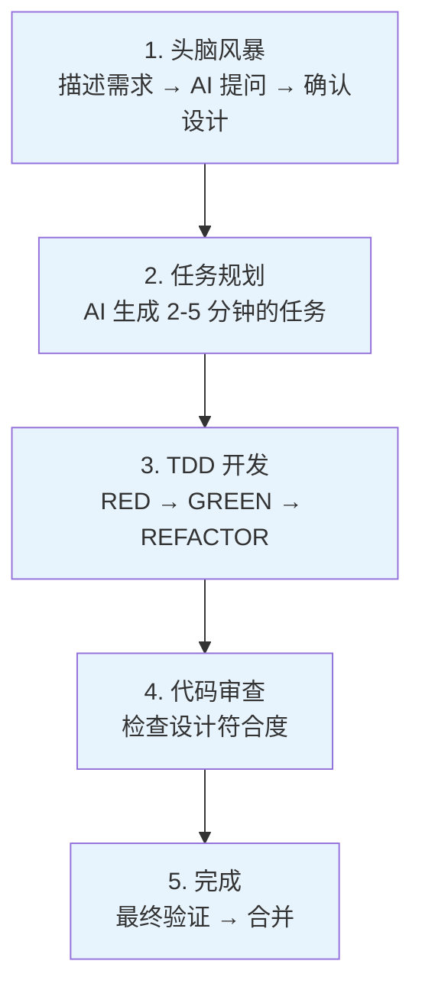
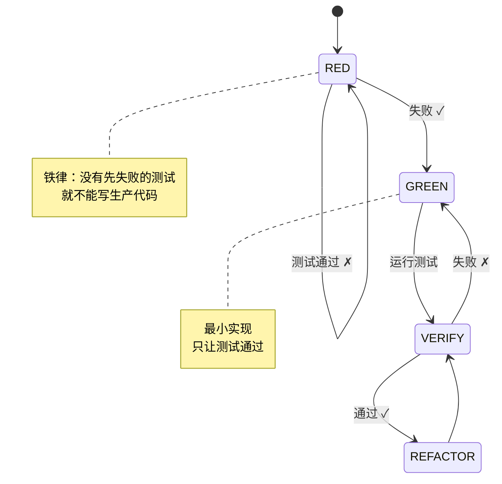

# 一张图看懂 Superpowers 如何使用

> 安装命令：
> ```
> /plugin marketplace add obra/superpowers-marketplace
> /plugin install superpowers@superpowers-marketplace
> ```
---

> AI 会问：「你的项目是 Web 应用、CLI 工具还是 API 服务？」
---

> TDD 每步：1. 写测试 → 2. 运行（失败）→ 3. 写实现 → 4. 运行（通过）→ 5. 提交
---

---
| 场景 | 操作 | 触发技能 |
|------|------|----------|
| 新功能开发 | 帮我规划这个功能：xxx | brainstorming + writing-plans |
| Bug 修复 | 帮我修这个 Bug：xxx | systematic-debugging |
| 代码审查 | 这个代码审查一下 | requesting-code-review |
| 验证完成 | 可以合并了 | verification-before-completion |
| 并行任务 | 同时实现这几个功能 | dispatching-parallel-agents |
---
| 场景 | 操作 | AI 自动做什么 |
|------|------|--------------|
| 新功能开发 | 描述需求 | brainstorming → writing-plans |
| 遇到 Bug | 描述问题 | systematic-debugging |
| 并行任务 | 让 AI 并行处理 | dispatching-parallel-agents |
| 验证完成 | 说"可以合并了" | verification-before-completion |
---
```
/plugin marketplace add obra/superpowers-marketplace
/plugin install superpowers@superpowers-marketplace
/plugin list
```
- 帮我规划这个功能：xxx
- 帮我修这个 Bug：xxx
- 这个代码审查一下
- 可以合并了
---
| 技能 | 触发方式 |
|------|----------|
| brainstorming | "帮我规划..."、"我想加..." |
| writing-plans | 设计确认后自动 |
| systematic-debugging | "修 Bug"、"出问题了" |
| requesting-code-review | 任务完成后自动 |
| verification-before-completion | "完成"、"合并" |
