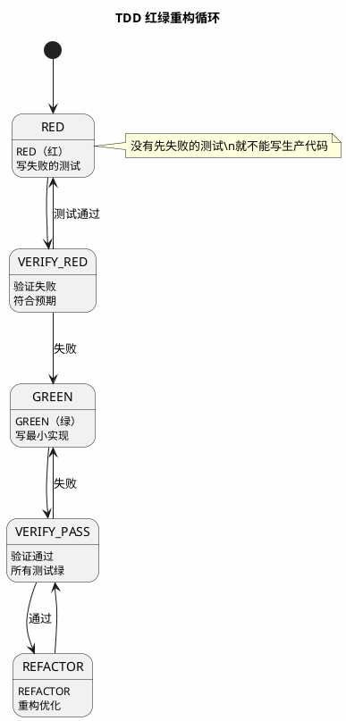
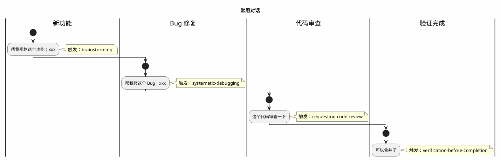

```plantuml
@startuml
skinparam backgroundColor #FEFEFE
title 安装 Superpowers（3 分钟）
|#E8F4FD|步骤 1|
:添加插件市场;
|#E8F4FD|步骤 2|
:安装核心技能包;
|#E8F4FD|步骤 3|
:开启新会话验证;
|#CCFFCC|完成|
:安装成功\nAI 自动调用技能;
step1 -> step2
step2 -> step3
step3 -> complete
note right of step1
/plugin marketplace add obra/superpowers-marketplace
end note
note right of step2
/plugin install superpowers@superpowers-marketplace
end note
@enduml
```
---
```plantuml
@startuml
skinparam backgroundColor #FEFEFE
title 验证安装
|#E8F4FD|输入|
:帮我规划这个功能：用户登录系统;
|#E8F4FD|预期|
:AI 自动调用 brainstorming + writing-plans;
|#E8F4FD|输出|
:我正在使用 brainstorming 技能...;
输入 -> 预期
预期 -> 输出
note right of 输出
在开始之前，我需要了解一下项目背景。
你的项目是 Web 应用、CLI 工具还是 API 服务？
end note
@enduml
```
---
```plantuml
@startuml
skinparam backgroundColor #FEFEFE
title 完整开发流程
|#E8F4FD|1. 头脑风暴|
:描述需求;
:AI 苏格拉底式提问;
:确认设计方案;
|#E8F4FD|2. 任务规划|
:AI 生成实施计划;
:每任务 2-5 分钟;
|#E8F4FD|3. TDD 开发|
:RED - 写失败测试;
:GREEN - 写最小实现;
:REFACTOR - 重构;
|#E8F4FD|4. 代码审查|
:检查设计符合度;
:报告严重程度;
|#E8F4FD|5. 完成|
:最终验证;
:选择合并;
|#CCFFCC|完成|
:代码合并主分支;
1 -> 2
2 -> 3
3 -> 4
4 -> 5
5 -> 完成
note right of 3
每步必须：
1. 写测试
2. 运行（失败）
3. 写实现
4. 运行（通过）
5. 提交
end note
note right of 4
❌ 严重问题（必修复）
💡 建议改进（可选）
✅ 通过项
end note
@enduml
```
---

---

---
| 场景 | 操作 | AI 自动做什么 |
|------|------|--------------|
| 新功能开发 | 描述需求 | brainstorming → writing-plans |
| 遇到 Bug | 描述问题 | systematic-debugging |
| 并行任务 | 让 AI 并行处理 | dispatching-parallel-agents |
| 验证完成 | 说"可以合并了" | verification-before-completion |
---
```
/plugin marketplace add obra/superpowers-marketplace
/plugin install superpowers@superpowers-marketplace
/plugin list
```
- 帮我规划这个功能：xxx
- 帮我修这个 Bug：xxx
- 这个代码审查一下
- 可以合并了
---
| 技能 | 触发方式 |
|------|----------|
| brainstorming | "帮我规划..."、"我想加..." |
| writing-plans | 设计确认后自动 |
| systematic-debugging | "修 Bug"、"出问题了" |
| requesting-code-review | 任务完成后自动 |
| verification-before-completion | "完成"、"合并" |
