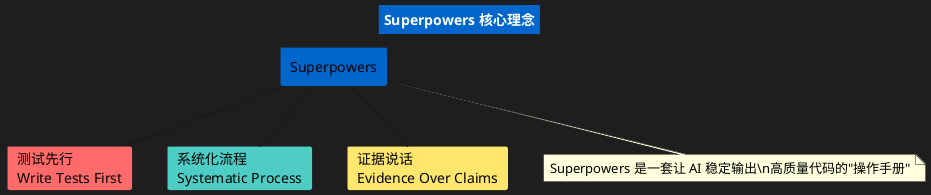
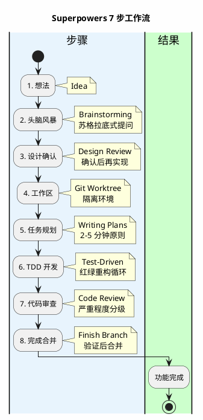
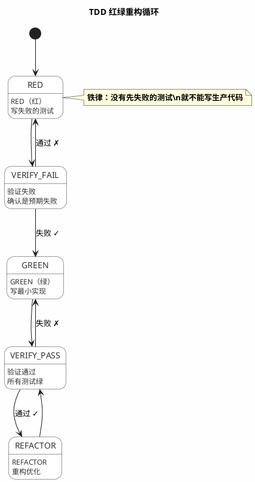
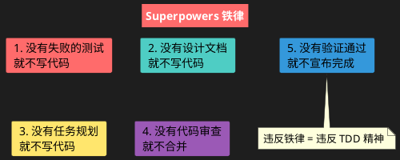

# 一张图看懂 Superpowers 原理

## 核心理念



---

## 核心流程



---

## TDD 红绿重构



---

## 解决问题

```plantuml
@startuml
skinparam backgroundColor #FEFEFE
skinparam style strictuml

title Superpowers 解决问题

top to bottom direction

rectangle "AI 缺陷" #FFCCCC width 200 {
  card "❌ 不可靠\n同一问题不同答案" as D1
  card "❌ 健忘症\n每次对话丢失上下文" as D2
  card "❌ 无纪律\n倾向于快速搞定" as D3
  card "❌ 难协作\n团队难以接手" as D4
  card "❌ 难追踪\n出现问题找不到原因" as D5
}

rectangle "Superpowers 解法" #CCFFCC width 200 {
  card "✅ 强制 TDD\n先写测试再写代码" as S1
  card "✅ 设计文档\n持久化保存上下文" as S2
  card "✅ 流程约束\n每步必须验证" as S3
  card "✅ 团队可读\n文档可传承" as S4
  card "✅ Git 历史\n完整可追溯" as S5
}

D1 --> S1
D2 --> S2
D3 --> S3
D4 --> S4
D5 --> S5

@enduml
```

---

## 简化版：一目了然

```
想法 ──▶ 头脑风暴 ──▶ 设计 ──▶ 任务规划 ──▶ TDD开发 ──▶ 代码审查 ──▶ 完成
         (提问)       (确认)    (拆分)        (测试)       (检查)      (合并)
```

**一句话理解**：用流程约束 AI 行为，让每一步都有验证。

---

## 核心原则速记


