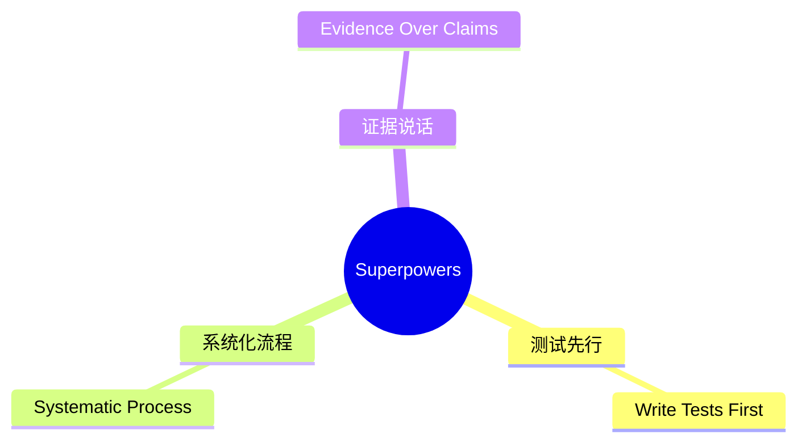
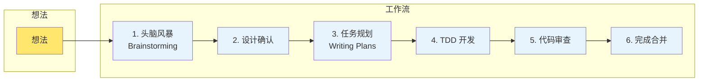
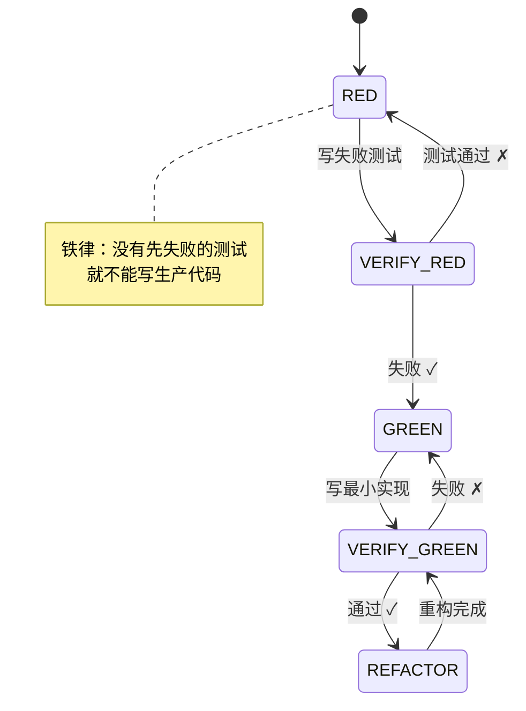
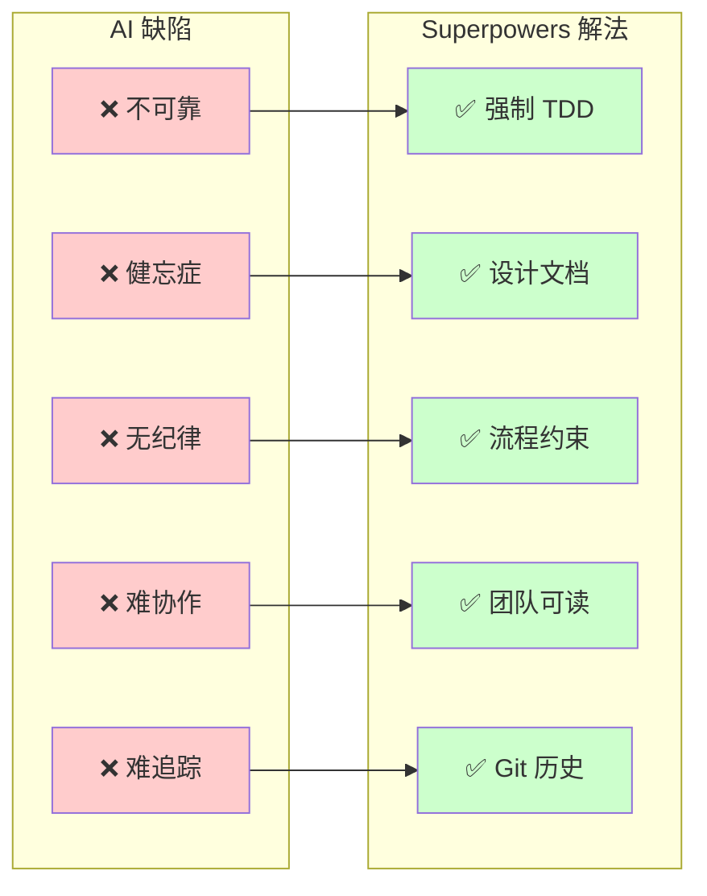

# 一张图看懂 Superpowers 原理

> Superpowers 是一套让 AI 稳定输出高质量代码的"操作手册"
---

---

---

---
```
想法 ──▶ 头脑风暴 ──▶ 设计 ──▶ 任务规划 ──▶ TDD开发 ──▶ 代码审查 ──▶ 完成
         (提问)       (确认)    (拆分)        (测试)       (检查)      (合并)
```
**一句话理解**：用流程约束 AI 行为，让每一步都有验证。
---
| 铁律 | 说明 |
|------|------|
| 1. 没有失败的测试，就不写代码 | TDD 核心 |
| 2. 没有设计文档，就不写代码 | 先想清楚 |
| 3. 没有任务规划，就不写代码 | 小步快跑 |
| 4. 没有代码审查，就不合并 | 质量把控 |
| 5. 没有验证通过，就不宣布完成 | 证据说话 |
